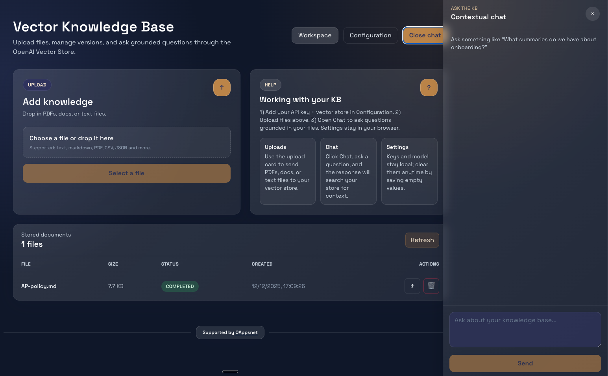

# Knowledge Base (React + Vite + Tailwind)

Local-first UI for managing an OpenAI Vector Store: upload files, refresh/delete/replace, and chat with grounded answers using your own API key. Settings (API key, model, vector store id) live in browser `localStorage`.

## Prerequisites
- Node.js 18+
- OpenAI API key

## Setup
```bash
npm install
```

## Development
```bash
npm run dev
# then open the printed localhost URL
```

## Build & preview
```bash
npm run build
npm run preview
```

## Using the app
1) Open Configuration, enter your OpenAI API key, model (e.g. `gpt-4o-mini`), and vector store id.  
2) If you need a new store, click “New” to create one.  
3) Upload files from Workspace; refresh/delete/replace as needed.  
4) Open Chat to ask questions; replies use file search against your vector store.

## Notes
- Settings stay in your browser; clear them by emptying the fields and saving.  
- Network requests go directly to OpenAI; no server is bundled here.

## UI Preview


If the image above doesn’t render, drop your latest screenshot at `docs/ui-preview.png` (as shown in the provided mock: two-column upload/help layout, file list below, and chat drawer on the right).

## Support
This project is quietly supported by Oappsnet.com, helping keep the lights on without the billboards.
